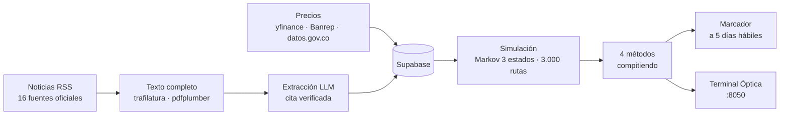

# Motor de Inferencia Causal

[](https://github.com/kaledoviedoo/macro-uncertainty-index/actions/workflows/diario.yml)


Estima cuánta **incertidumbre** hay sobre 20 activos financieros a 5 días, leyendo cada noche los comunicados de bancos centrales y agencias oficiales. No predice si un activo sube o baja: predice cuánto se ensancha su distribución, y lleva un marcador que comprueba si acierta.

---

## Demo visual



La secuencia completa corre sola de lunes a viernes en GitHub Actions y tarda unos 10 minutos.

> Captura de la Terminal: pendiente. Se genera con `.\motor.ps1 app`.

---

## Stack Tecnológico

| Capa | Herramientas |
|---|---|
| Lenguaje | Python 3.12+ |
| Datos | pandas, NumPy, scikit-learn |
| Validación | Pydantic v2 |
| Base de datos | Supabase (PostgreSQL) con RLS |
| Interfaz | Dash + Plotly |
| Extracción | Groq (`gpt-oss-120b`), Gemini como respaldo |
| Ingesta | yfinance, feedparser, trafilatura, pdfplumber |
| Infraestructura | GitHub Actions (cron diario) |

**Fuentes de datos:** Reserva Federal, BCE, Banco de Inglaterra, Banco de Japón, Banrep, BLS, BEA, SEC, USTR, EIA, Financial Times, SDMX de Banrep, datos.gov.co.

---

## Features principales

- **Distribución, no dirección.** El modelo no estima si el precio sube. Estima el ancho del cono y hacia qué lado engorda la cola, que es lo que un documento oficial sí permite deducir.
- **Cita verificada mecánicamente.** Cada impacto exige una frase literal del documento, comprobada con coincidencia exacta o 92 % de cobertura de tokens. Sin cita no se escribe la fila.
- **Marcador que se niega a puntuar.** Con menos de 20 caídas resueltas no publica ranking y explica por qué: ordenar por Brier cuando casi nada ha ocurrido premia al que declara la probabilidad más baja.
- **Cuatro métodos con el mismo sorteo.** `baseline_naive`, `baseline_tendencia`, `llm_ajustado` y `regla_vix` simulan con números aleatorios comunes, así que la diferencia entre ellos no es ruido de muestreo.
- **Grafo auditable.** `sinapsis` muestra, para cada activo, qué noticias ensanchan su cono, con la cita, la fuente y la aritmética que produce el factor.
- **Detectores de relleno.** Marca los abanicos (varios activos, un canal, factores en escalera) y recorta la confianza de los titulares sin cuerpo. Las filas marcadas se conservan para poder medir si apartarlas fue correcto.
- **Régimen de mercado.** Cadena de Markov de 3 estados (normal, estrés, shock) estimada sobre 2.520 días, para que la simulación no proyecte solo días buenos.
- **Ejecución desatendida.** GitHub Actions corre la secuencia cada tarde sin necesidad de dejar el equipo encendido.

---

## Instalación (Getting Started)

**Requisitos:** Python 3.12+, una cuenta de Supabase (plan gratuito) y una clave de Groq o Gemini (ambas gratuitas).

```powershell
git clone https://github.com/kaledoviedoo/macro-uncertainty-index.git
cd macro-uncertainty-index

# Crea el entorno virtual e instala dependencias
powershell -ExecutionPolicy Bypass -File .\setup.ps1
```

```bash
# En Linux o macOS
python -m venv .venv && source .venv/bin/activate
pip install -r requirements.txt
```

**Base de datos.** En el editor SQL de Supabase, ejecuta en orden:

```
db/schema.sql
db/migracion_001_lote_uniforme.sql
db/migracion_002_razonamiento.sql
```

**Credenciales.** Copia `.env.example` a `.env` y rellena:

```ini
SUPABASE_URL=https://TU_PROYECTO.supabase.co
SUPABASE_ANON_KEY=sb_publishable_...
SUPABASE_SERVICE_KEY=sb_secret_...
GROQ_API_KEY=gsk_...
```

**Comprobación.**

```powershell
.\motor.ps1 verificar    # prueba la conexión y las fuentes
.\motor.ps1 precios      # carga 10 años de histórico
.\motor.ps1 estado       # panel de control
```

Para la ejecución automática, define esas cuatro variables como *secrets* del repositorio. El workflow de `.github/workflows/diario.yml` no necesita nada más.

---

## Ejemplos de uso

```powershell
.\motor.ps1                    # lista los 19 comandos
.\motor.ps1 app                # Terminal Óptica en localhost:8050
.\motor.ps1 sinapsis           # el grafo causal vigente
.\motor.ps1 predecir --seco    # calcula sin escribir
.\motor.ps1 marcador           # resultados acumulados
```

Consultar el grafo de un solo activo:

```powershell
python scripts\sinapsis.py --ticker CL=F
```

```
CL=F         Petroleo WTI (futuros)
factor 1.77   sesgo -0.00   ·   13 impacto(s) vigente(s)

   x1.30 ↓ oferta   30d   conf 0.85   aporta 0.587  (23 % de su canal)
      EIA - Today in Energy  ·  N1  ·  2026-08-24  ·  2,444 car.
      «Seaborne petroleum product exports from Nigeria have grown sevenfold»

   composición por canal   (el mayor entero, el resto al 33 %):
     oferta               0.587 + 0.33·2.773  =  1.502
     riesgo_geopolitico   0.345 + 0.33·0.161  =  0.398
     exceso total                                2.120
   raíz(1 + 2.120) = 1.77
```

Ejecutar las pruebas (62 comprobaciones, sin red ni base de datos):

```powershell
py pruebas\filtros.py
py pruebas\banrep.py
py pruebas\marcador.py
py pruebas\composicion.py
py pruebas\grafo.py
```

---

## Estructura de directorios

```
macro-uncertainty-index/
├── app.py                      Terminal Óptica (Dash)
├── motor.ps1                   Lanzador con 19 subcomandos
├── setup.ps1                   Entorno virtual y dependencias
├── db/
│   ├── schema.sql              Tablas, vistas y políticas RLS
│   ├── migracion_*.sql         Cambios incrementales
│   └── volcar_esquema.sql      Regenera schema.sql desde la base
├── scripts/
│   ├── comun.py                Conexión, paginación, escritura por lotes
│   ├── ingestar_precios.py     yfinance + clasificación de régimen
│   ├── ingestar_banrep.py      Series colombianas vía SDMX
│   ├── ingestar_noticias.py    RSS de 16 fuentes oficiales
│   ├── enriquecer.py           Texto completo (HTML y PDF)
│   ├── modelos.py              Esquema Pydantic y filtros de calidad
│   ├── prompts.py              Instrucciones del extractor
│   ├── extraer.py              Lote nocturno con el LLM
│   ├── pronostico.py           Simulador Markov compartido
│   ├── predecir.py             Emite las predicciones del día
│   ├── resolver.py             Cobra las vencidas y calcula el marcador
│   ├── sinapsis.py             Inspector del grafo causal
│   ├── calendario.py           Eventos de fecha conocida
│   ├── evaluar.py              Señales de caída en muestra
│   ├── modelo_caidas.py        Validación fuera de muestra
│   └── estado.py               Panel de control
└── pruebas/                    62 comprobaciones sin red
```

---

## Contacto

**Kaled Oviedo** · [@kaledoviedoo](https://instagram.com/kaledoviedoo) en Instagram · [github.com/kaledoviedoo](https://github.com/kaledoviedoo)
